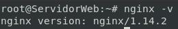
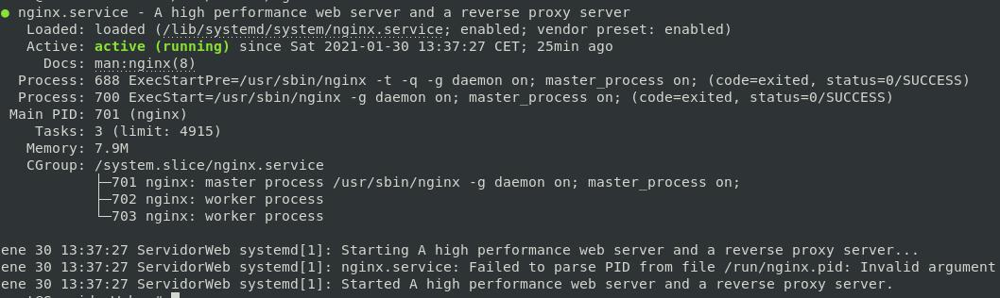
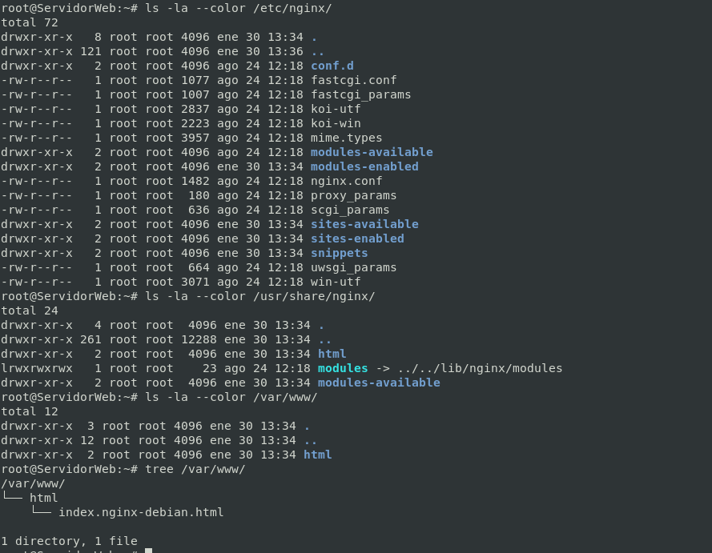

# Primeros Pasos
<!-- NGINX -T -->
## Proceso de Instalación

### Pre-Intalación

*Aconsejo no usar una máquina en la ya exista un servicio web apache2*
*Si tenemos instalado apache2 aconsejo borrarlo por completo...*

```bash
systemctl stop apache2.service 
systemctl disable apache2.service
# SI EXISTEN PROYECTOS Y SERVICIOS WEBs EN PRODUCCIÓN EN EL SERVIDOR WEB QUIZÁS
# PREFIERAS HACER UNA COPIA DE SEGURIDAD DE ESTO YA QUE LOS VAMOS A ELIMINAR
rm -R /etc/apache2/*
rm -R /var/www/*
rm -R /var/log/apache2/
apt purge apache2
apt autoremove
```
*Aconsejo no usar máquina en la que ya tuvisemos un servicio web apache*

### Instalación

```bash
apt update
apt-get install nginx -y
systemctl status nginx.service
```

## Versión de Nginx instalado.

```bash
nginx -v
```



## Servicio asociado.

```bash
systemctl status nginx.service
```
ó

```bash
/etc/init.d/nginx status
```


## Ficheros de configuración.

```bash
ls -la --color /etc/nginx/
ls -la --color /usr/share/nginx/
ls -la --color /var/www/
```



## Configuraciones Avanzadas

### [Página web por defecto](CasosPracticosApartados/paginaWebDefecto.md)
### [Virtual Hosting](CasosPracticosApartados/VirtualHosting.md)
### [Autentificación, Autorización y Control de acceso](CasosPracticosApartados/autenAutoContAcc.md)
### [Seguridad](CasosPracticosApartados/seguridad.md)
________________________________________
*[Volver al índice...](../README.md)*