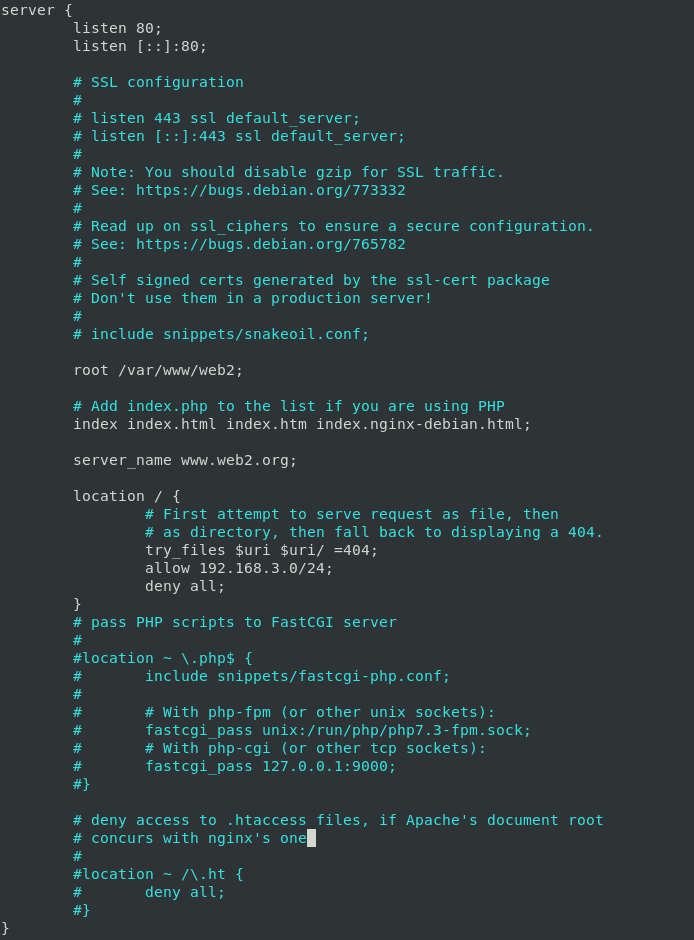
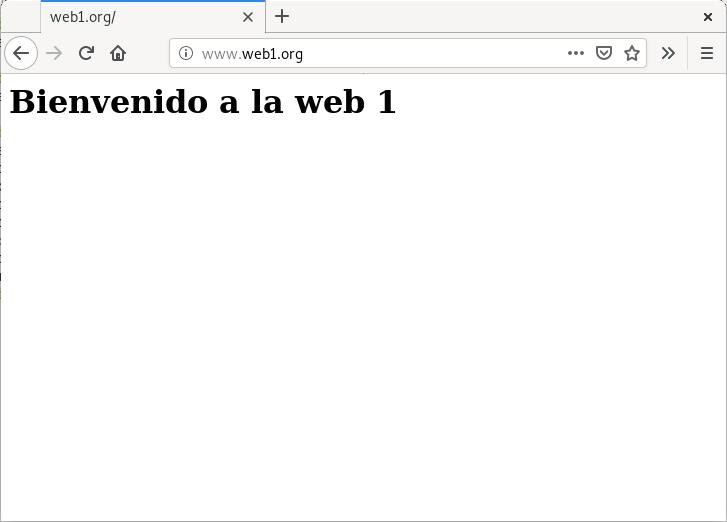
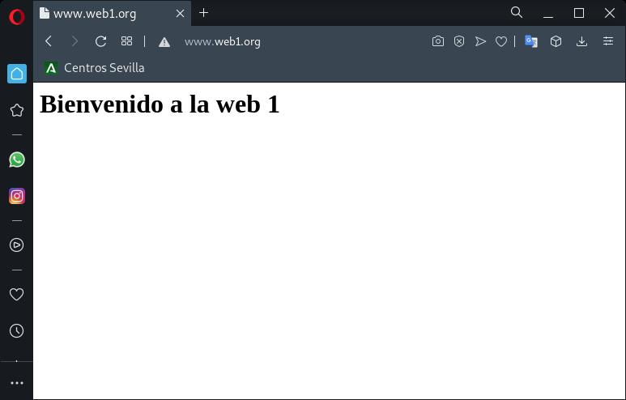
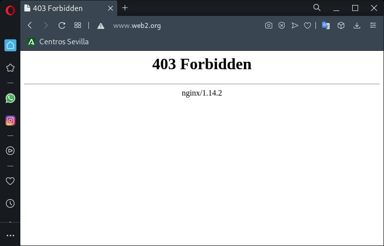
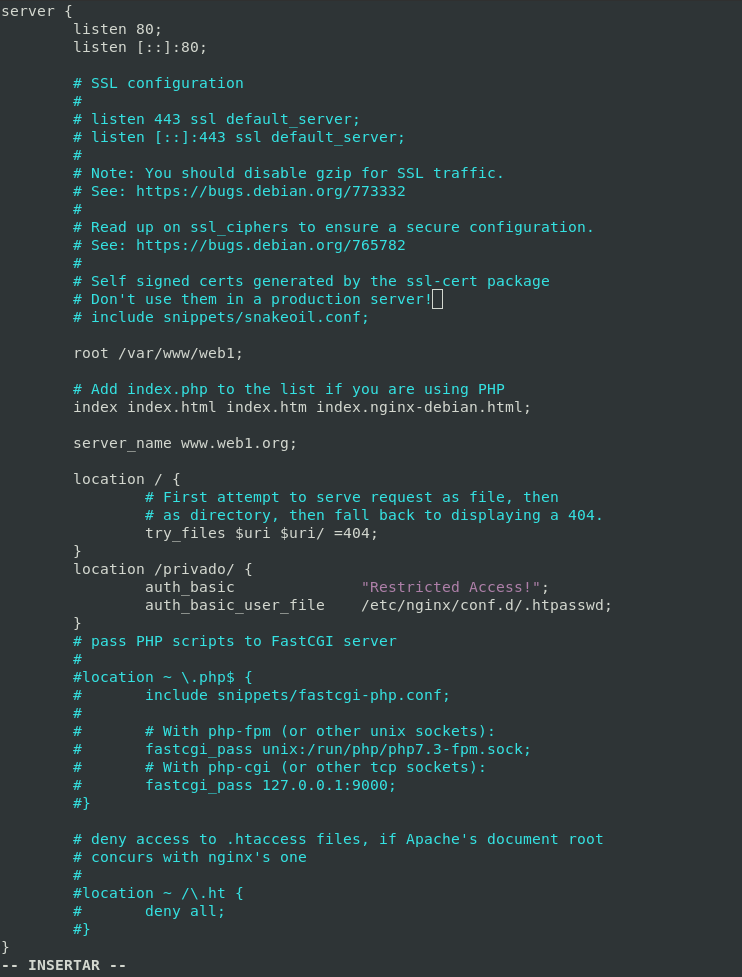

# Autentificación, Autorización y Control de acceso

## Ejercicio F

- www.web1.org se puede acceder desde la red externa y la red interna.
- www.web2.org sólo se puede acceder desde la red interna.

### Configuración del Virtual Host



**Quitando los comentarios y lineas en blanco así quedaría nuestro sitio virtual:**

```nginx
server {
        listen 80;
        listen [::]:80;
        root /var/www/web1;
        index index.html index.htm index.nginx-debian.html;
        server_name www.web1.org;
        location / {
                # First attempt to serve request as file, then
                # as directory, then fall back to displaying a 404.
                try_files $uri $uri/ =404;
                allow 192.168.3.0/24;
                deny all;
        }
}
```
[Clic para descargar configuración](../../ficherosConfiguracion/web2.org.EjercicioF.conf)

### Recargarmos el servicio de Nginx

```bash
systemctl reload nginx
```

### Comprobación

#### Cliente-red interna

Acceso www.web1.org:



Acceso www.web2.org:


#### Cliente-red externa

Acceso www.web1.org:



Acceso www.web2.org:



## Ejercicio G

- www.web1.org contiene un directorio llamado privado.
- Configura una autentificación básica. Sólo puede acceder usuarios válidos.

### Creamos el directorio privado

```bash
mkdir /var/www/web1/privado
chown -R www-data:www-data /var/www/web1/ 
```

### Crear archivo de usuario de autenticación HTTP

Comenzamos creando un archivo que almacene pares de usuario y contraseña. Usaremos la utilidad de apache ``htpasswd`` para crear este archivo.

#### Paso previo...

Comprobamos que ``apache2-utils`` se encuentra instalado para poder usar ``htpasswd`` .
*Para RHEL y Centos 8 : ``httpd-tools``*

```bash
apt policy apache2-utils
```
*Si no esta instalado...*

```bash
apt install apache2-utils
```

#### Creamos usuarios

```bash
htpasswd -c /etc/nginx/conf.d/.htpasswd usuario01
```

*Para crear un segundo usuario NO usar la opción -c.*(Unicamente usar la primera vez para crear el fichero)**

```bash
htpasswd /etc/nginx/conf.d/.htpasswd admin
```
*Comprobamos los usuarios creados*

```bash
cat /etc/nginx/conf.d/.htpasswd
```

### Configuración del Virtual Host



**Quitando los comentarios y lineas en blanco así quedaría nuestro sitio virtual:**

```nginx
server {
        listen 80;
        listen [::]:80;
        root /var/www/web1;
        index index.html index.htm index.nginx-debian.html;
        server_name www.web1.org;
        location / {
                try_files $uri $uri/ =404;
                }
}
location /privado/ {
		auth_basic           	"Restricted Access!";
    		auth_basic_user_file 	/etc/nginx/conf.d/.htpasswd; 
	}
```
[Clic para descargar configuración](../../ficherosConfiguracion/web1.org.EjercicioG.conf)

### Recargarmos el servicio de Nginx

```bash
systemctl reload nginx
```

<!-- ### Comprobación

#### Cliente-red externa

Acceso www.web1.org:

 -->

________________________________________
*[Volver atrás...](../CasosPracticos.md)*

*[Ir a Siguiente punto...](./seguridad.md)*
