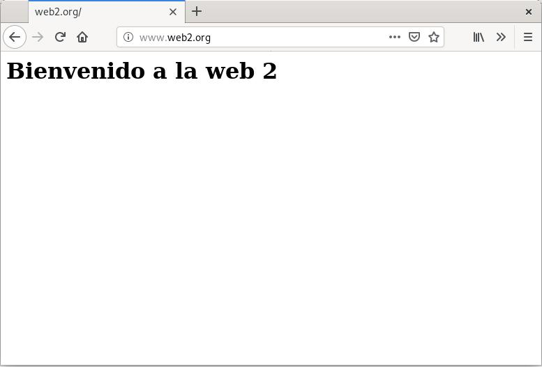

# Autentificación, Autorización y Control de acceso

## Ejercicio F

- www.web1.org se puede acceder desde la red externa y la red interna.
- www.web2.org sólo se puede acceder desde la red interna.

### Coniguración del VirtualHost


**Quitando los comentarios y lineas en blanco así quedaría nuestro sitio virtual:**

```nginx
server {
        listen 80;
        listen [::]:80;
        root /var/www/web1;
        index index.html index.htm index.nginx-debian.html;
        server_name www.web1.org;
        location / {
                # First attempt to serve request as file, then
                # as directory, then fall back to displaying a 404.
                try_files $uri $uri/ =404;
                allow 192.168.3.0/24;
                deny all;
        }
}
```

[Clic para descargar configuración](../../ficherosConfiguracion/web2.org.EjercicioF.conf)

### Comprobación

#### Cliente-red interna:

Acceso www.web1.org


Acceso www.web2.org


#### Cliente-red externa:

Acceso www.web1.org


Acceso www.web2.org


________________________________________
*[Volver atrás...](../CasosPracticos.md)*

*[Ir a Siguiente punto...](./seguridad.md)*
