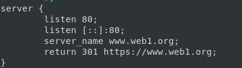
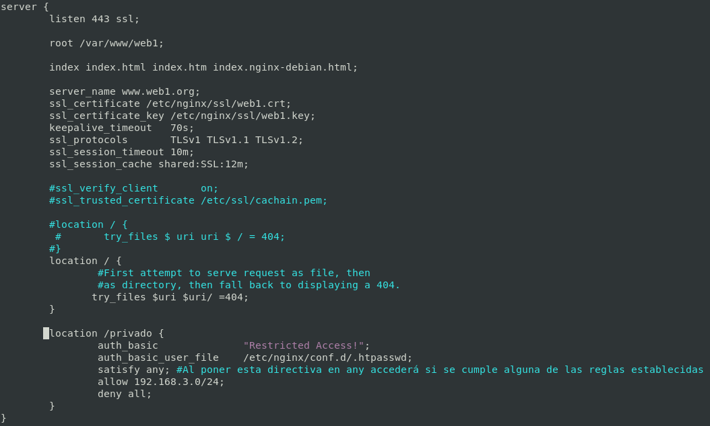
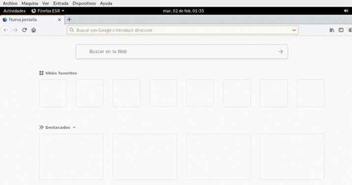

# Seguridad (BETA)

Se recomienda encarecidamente que el tráfico cifrado utilice solo protocolos TLS más nuevos, en lugar de SSL. Ambas versiones de SSL ampliamente disponibles en la actualidad (SSLv2 y SSLv3) tienen fallas de seguridad graves y nunca deben usarse en entornos de producción.

*En esta práctica por ello definiré comuniaciones cifradas **TLS** y no **SSL***

## Protocolos de cifrado
<!-- Dejo una pequeña tabla con tipos de cifrados: -->

## Generar certificado y claves
Con el siguiente comando generamos tanto la clave privada como el certificado con openssl

```bash
sudo openssl req -x509 -nodes -days 1095 -newkey rsa:2048 -keyout /etc/nginx/ssl/web1.key -out /etc/nginx/ssl/web1.crt
```

<!-- ```bash
sudo openssl req -x509 -nodes -days 1095 -newkey rsa:2048 -keyout /etc/nginx/ssl/web2.key -out /etc/nginx/ssl/web2.crt
``` -->

## Coniguración del Virtual Host




## **Quitando los comentarios y lineas en blanco así quedaría nuestro sitio virtual:**

```nginx
server {
	listen 443 ssl;

        root /var/www/web1;

        index index.html index.htm index.nginx-debian.html;
	
        server_name www.web1.org;
        ssl_certificate /etc/nginx/ssl/web1.crt;
        ssl_certificate_key /etc/nginx/ssl/web1.key;
    	keepalive_timeout   70s;
    	ssl_protocols       TLSv1 TLSv1.1 TLSv1.2;
    	ssl_session_timeout 10m;
    	ssl_session_cache shared:SSL:12m;
	
	location / {
            try_files $uri $uri/ =404;
        }

	location /privado {
                auth_basic              "Restricted Access!";
                auth_basic_user_file    /etc/nginx/conf.d/.htpasswd;
                satisfy any; #Al poner esta directiva en any accederá si se cumple alguna de las reglas establecidas
                allow 192.168.3.0/24;
                deny all;
        }
}
server {
	listen 80;
	listen [::]:80;
	server_name www.web1.org;
	return 301 https://www.web1.org;
}
```

## Vayamos un paso más...

### ¿Mejoramos disponibilidad?

Con las siguientes directivas intentaremos mejorar el rendimiento de nuestro servidor web, al añadir una capa de cifrado en las comunicaciones esto supone un gran impacto en el rendimiento de nuestro servicio web, para ellos aplicaremos las siguientes medidas: (La aplicación de estas debe ser estudiada por el administrador con detalle o puede llegar a tener el efecto contrario).

- Establece un tiempo de espera durante el cual una conexión de cliente permanecerá abierta en el lado del servidor

```nginx 
keepalive_timeout   70s;
```

- Por defecto, el tiempo que durá una comunicación es de 5m, indicaré **un tiempo mayor** para reducir el número nuevas conexiones con el mismo cliente.

```nginx 
ssl_session_timeout 10m;
```

- Cachear las sesiones SSL para evitar generar una nueva sesión con cada conexión

```nginx
ssl_session_cache shared:SSL:12m;
```

En estas pocas líneas e intentado explicar los mejor posibles algunas de las tantas directivas posibles que existen. Dejo URL Nginx para consultar toda esta documentación:

<http://nginx.org/en/docs/http/ngx_http_ssl_module.html>

<!-- http://nginx.org/en/docs/http/ngx_http_ssl_module.html#ssl_session_timeout -->
<!-- https://docs.nginx.com/nginx/admin-guide/security-controls/terminating-ssl-http/ -->

## Comprobación



________________________________________
*[Volver atrás...](../CasosPracticos.md)*